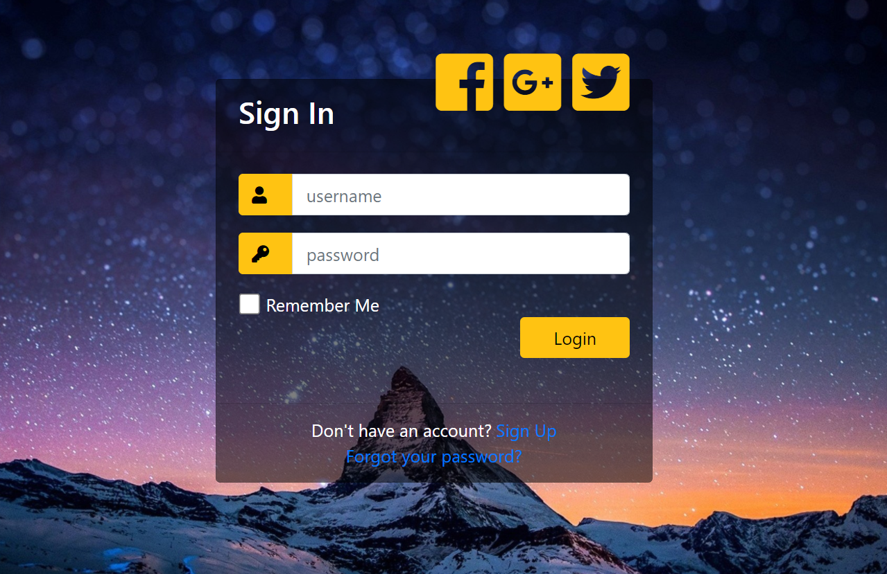

# Create a Simple Login Form in PHP

## What is PHP MVC framework?
PHP MVC is an application design pattern that separates the application data and business logic (model) from the presentation (view). MVC stands for Model, View & Controller.

The controller mediates between the models and views.

Think of the MVC design pattern as a car and the driver.

The car has the windscreens (view) which the driver (controller) uses to monitor traffic ahead then speed or brake (model) depending on what he sees ahead.

## Why use PHP MVC Framework?

PHP MVC Frameworks simplify working with complex technologies by;
* Hiding all the complex implementation details
* Providing standard methods that we can use to build our applications.
* Increased developer productivity, this is because the base implementation of activities such as connecting to the database, sanitizing user input etc. are already partially implemented.
* Adherence to professional coding standards

## In this tutorial, you will learn-

* PHP MVC Design Pattern
* Creating Our Model
* Creating Our Views
* Testing our application
* Database configuration settings

## Step 1
Create a new PHP project and name it ``Form``

## Step 2
Create 3 folders in your PHP project and a single PHP file ``index.php``

## Step 3
In ``controllers`` folder, create a new PHP file with the name controller.php and insert the following code.

## Step 4
In ``models`` folder, create a new PHP file with the name models.php and insert the following code.

## Step 5
Create two new PHP files in the ``views`` folder, with the names _login.php_ and _profile.php_

## Step 6
Finally, open the index.php and insert the following code.

## Step 7
Test your code into your browser such as localhost/form. It was a simple login form but you can add CSS to style it further.

## TO DO
Now you can add other pages for ``Logout``, ``Create Account`` & ``Forgot password``, using database

## Références
* [Le MVC](https://nouvelle-techno.fr/actualites/live-coding-php-oriente-objet-le-mvc)
* [PHP MVC](http://thecodetutorial.com/php-mvc)